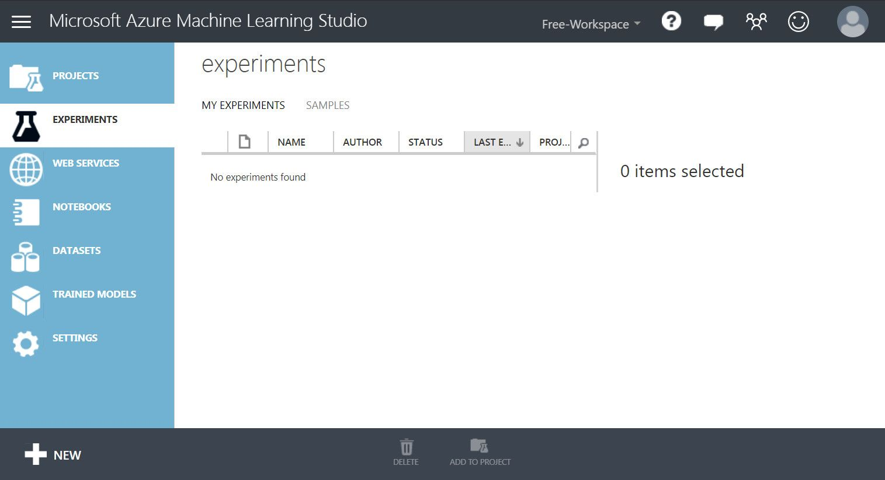
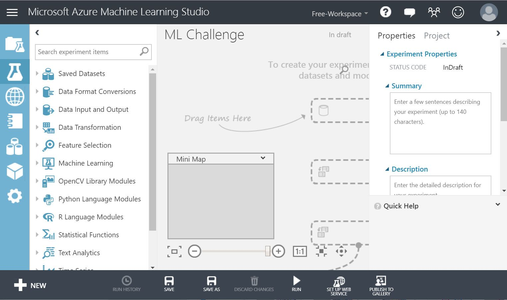

# 概要
Machine Learning Challenge では、[Azure Machine Learning Studio](https://azure.microsoft.com/services/machine-learning-studio/)を使用して、主要な米国航空会社の到着時刻データを利用したシンプルな（そして非常に正確な）機械学習のモデルを構築します。
そのときには、自分自身でモデルをチューニングして精度を高めます。
目標は、所定のフライトが到着予定時刻通りに到着する可能性を予測するための、実世界で有用なモデルを作成することです。

## 前提条件
- Microsoft のアカウント（[https://account.microsoft.com/account]()）
- Microsoft Edge や Google Chrome などの最新のブラウザ

# 演習
Machine Learning Challenge では、以下の演習を実施します。
- 演習1：機械学習の実験を作成する
- 演習2：データセットを読み込む
- 演習3：分類モデルを訓練する
- 演習4：モデルをチューニングする

# 演習1：機械学習の実験を作成する
最初のステップでは、Azure Machine Learning Studio を使用するために、機械学習の実験（Experiment）を以下の手順で作成します。

1. Webブラウザで[http://studio.azureml.net/]()に移動し、[Sign Up]をクリックします。

1. Microsoft アカウントを使用してサインインします。

1. ページの左下にある[+ NEW]をクリックし、[Blank Experiment]をクリックして、新しい実験を作成します。

1. ページ上部の実験タイトル（Experiment created on ...）をクリックし、新しい実験名として「ML Challenge」と入力します。

これで、機械学習のモデルを構築、訓練およびテストすることができる機械学習の実験を作成できました。
次のステップでは、訓練とテストに使用するためのデータセットをアップロードします。