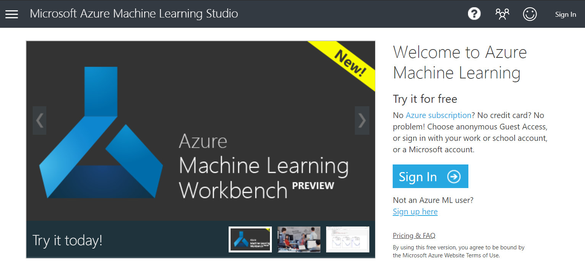
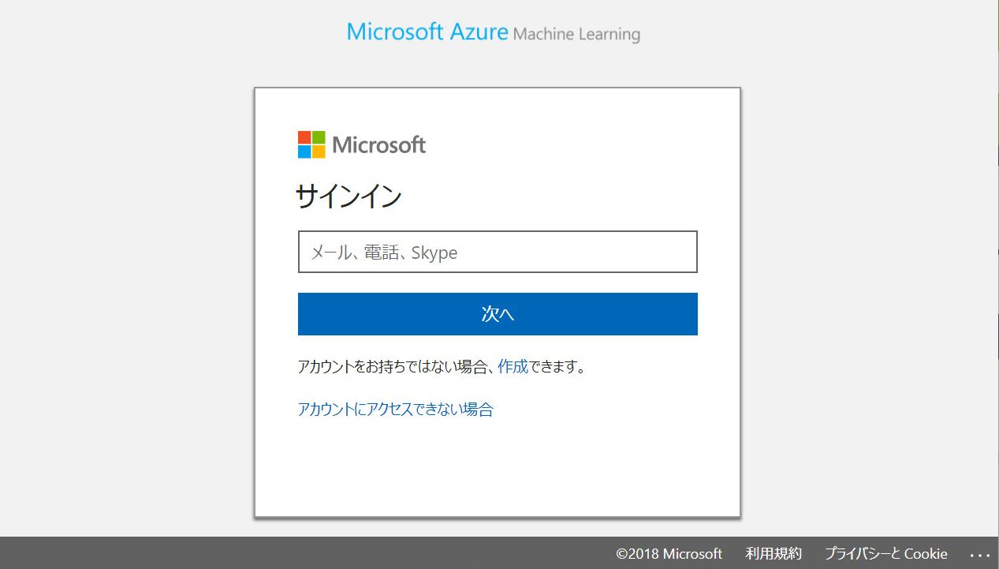
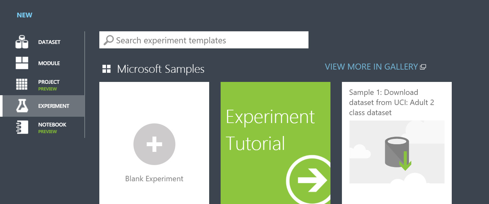

# 概要
Machine Learning Challenge では、[Azure Machine Learning Studio](https://azure.microsoft.com/services/machine-learning-studio/)を使用して、主要な米国航空会社の到着時刻データを利用したシンプルな（そして非常に正確な）機械学習のモデルを構築します。
そのときには、自分自身でモデルをチューニングして精度を高めます。
目標は、所定のフライトが到着予定時刻通りに到着する可能性を予測するための、実世界で有用なモデルを作成することです。

## 前提条件
- Microsoft のアカウント（[https://account.microsoft.com/account]()）
- Microsoft Edge や Google Chrome などの最新のブラウザ

# 演習
Machine Learning Challenge では、以下の演習を実施します。
- 演習1：機械学習の実験を作成する
- 演習2：データセットを読み込む
- 演習3：分類モデルを訓練する
- 演習4：モデルをチューニングする

# 演習1：機械学習の実験を作成する
最初のステップでは、Azure Machine Learning Studio を使用するために、機械学習の実験（Experiment）を以下の手順で作成します。

1. Webブラウザで[http://studio.azureml.net/]()に移動し、[Sign Up]をクリックします。

1. Microsoft アカウントを使用してサインインします。

1. ページの左下にある[+ NEW]をクリックし、[Blank Experiment]をクリックして、新しい実験を作成します。

1. ページ上部の実験タイトル（Experiment created on ...）をクリックし、新しい実験名として「ML Challenge」と入力します。

これで、機械学習のモデルを構築、訓練およびテストすることができる機械学習の実験を作成できました。
次のステップでは、訓練とテストに使用するためのデータセットをアップロードします。

# 演習2：データセットの読み込み
Azule ML Studioには「実験」にデータを読み込むための仕組みが複数用意されています。この演習では、Azure blob Storageサービス上に用意されているZpiファイルをダウンロードし、ML Studioに用意されているローカルファイルの読み込み機能(From Local File)を使って演習1で作成した「実験」にデータセットを追加します。

データセットには、米国大手の航空会社の飛行機到着時刻が含まれています。
なお、このデータセットは[アメリカ交通統計局](https://www.bts.gov/)が提供する[データセット](https://www.transtats.bts.gov/DL_SelectFields.asp?Table_ID=236&DB_Short_Name=On-Time)のサブセット版です。

1. Zipファイルを[こちら](https://mlchallenge.blob.core.windows.net/public/FlightData.zip)からダウンロードし、中に含まれているFlightData.csvとBigFlightData.csvを取り出します。
>FlightData.csvは11231件のデータが、BigFlightData.csvは44360件のデータが含まれており、FlightData.csvはBigFlightData.csvのサブセットになっています。
>演習3では学習時間短縮のためデータ数が少ないFlightData.csvを使いますが、演習4ではお好みでBigFlightData.csvを用いてもらっても構いません。

1. ML Studioの戻り、「NEW」を選択し、「DATASET」から「FROM LOCAL FILE」を選択します。

1. Upload a new datasetダイアログの「Brouse」ボタンを選択し、保存したFlightData.csvを選択します。
SELECT A TYPE FOR THE NEW DATASETが「Generic CSV File with a header(.csv)」になっていることを確認し、右下の「チェックボタン」を押してデータセットをアップロードします。

1. データセットアップロード後、「Module Pallete」に戻り、左側のメニュー「Saved Datasets」以下にある「FlightData.csv」を探し、パレット上にドラッグ・アンド・ドロップします。

1. このデータセットに何が含まれているかを確認してみます。パレット上「FlightData.csv」を右クリックし、「Visualize」を選択します。

1. データセットの中身が表示されます。このデータセットは11231行、25列のデータを含みます。
各行は1回の飛行を表し、飛行日(YEAR, MONTH, DAY_OF_MONTH)や飛行に関する例えば出発地(ORIGIN)と目的地(DEST)、予定出発時刻(CRS_DEP_TIME)と到着時刻(CRS_ARR_TIME)、到着時刻の遅れ(ARR_DELAY)や15分以上遅れていたかどうか(ARR_DEL15)などが含まれます。

以下に各行の意味を示します。
なお、時刻はHHMMという形式で保存されています。(例:午後3時-1500)

|Column|Description|
|---------------------|----------------------------------------------------------------------------------|
|YEAR|飛行年|
|QUARTER|飛行四半期 (1-4)|
|MONTH|飛行月 (1-12)|
|DAY_OF_MONTH|飛行日 (1-31)|
|DAY_OF_WEEK|飛行曜日 (1=月曜, 2=火曜...)|
|UNIQUE_CARRIER|航空会社コード (例：DL, NH)|
|TAIL_NUM|機体番号|
|FL_NUM|便番号|
|ORIGIN_AIRPORT_ID|出発空港ID|
|ORIGIN|出発空港コード (例：ATL, DFW, HND)|
|DEST_AIRPORT_ID|到着空港ID|
|DEST|到着空港コード (例：ATL, DFW, HND)|
|CRS_DEP_TIME|出発予定時刻|
|DEP_TIME|実際の出発時刻|
|DEP_DELAY|出発時間の遅れ|
|DEP_DEL15|0=15分未満の出発の遅れ, 1=15分以上の出発の遅れ|
|CRS_ARR_TIME|到着予定時刻|
|ARR_TIME|実際の到着時刻|
|ARR_DELAY|到着時間の遅れ|
|ARR_DEL15|0=15分未満の到着の遅れ, 1=15分以上の到着の遅れ|
|CANCELLED|0=飛行が行われた, 1=飛行は中止された|
|DIVERTED|0=予定通りの目的地へ着陸した, 1=予定外の目的地へ着陸した|
|CRS_ELAPSED_TIME|予定されている飛行時間(分)|
|ACTUAL_ELAPSED_TIME|実際の飛行時間(分)|
|DISTANCE|出発地と目的地の距離(マイル)|

> なお、これらすべてのデータが予測モデルに用いられるわけではありません。
> 例えば飛行機の機体番号が特定のものだからと飛行が遅れたり、飛行が中止されたり、予定外の空港に着陸するということはないように、機体番号は飛行時間の予測には用いることが出来ません。
> このように明らかに予測モデルに用いれないものが含まれていても、モデル作成時に除外することが出来ます。

1. データセットの列を適当に選択すると、右側の列に詳細が表示されます。

1. 右上の×ボタンを押して「Visualize」ウィンドウを閉じます。

これでデータセットが読み込まれます。

# 演習3 分類器の学習

この章では MLスタジオのドラッグアンドドロップUIを使用してモデルを構築、学習アルゴリズムを選択し、学習に使うデータを選択して、学習させます。

機械学習のモデルにはいくつかの種類があり、有名なものの一つに回帰モデルがあります。
多数の回帰アルゴリズムのいずれかを利用し数値を生成するモデルで、例えば、年齢やクレジットカードの取引が不正であるかどうかを判定するのに用いられています。

今回は複数の入力データから既知の出力の一つを出力する分類モデルを学習させます。

分類モデルの古典的な例は電子メールの本文から迷惑メールかそうでないかを分類するものです。

ここでは第2章で読み込ませたデータセットを利用し、飛行機が定刻に到着するか遅刻するかを予測する分類器を学習させます。

1. モジュールパレット上部の検索ボックスに「select columns」を入力し、データセットモジュールの「Select Columns」を見つけます。
モジュールをキャンバス上にドラッグし、データセットの下にドロップします。
次に、データセットの出力ポートをドラッグし、表示された矢印を「Select Columns」モジュールの入力ポートに接続します。

> Azure ML Studioでは「ポート」と「コネクタ」という概念があります。
> 先程データセットの出力ポートを「Select Columns」モジュールの入力ポートに接続しました。
> このようにモジュール間を接続することでデータを次のモジュールに伝えることが出来ます。
> また、モジュールは複数の入出力ポートをサポートしているため、モジュールによっては入力や出力ポートが複数あります。
> ポートが何をするのかを知りたい場合は、ポートの上にカーソルを乗せるとツールチップが表示されます。
> 更に詳しい情報は、モジュールを右クリックし、ポップアップメニューから「Help」を選択してください。

1. データセットモジュール内の「Select Columns」を選択し、右側プロパティーパネルに表示される「Launch column selector」を選択します。

1. 「Available Columns」から以下の項目を選択します。

* MONTH
* DAY_OF_MONTH
* DAY_OF_WEEK
* ORIGIN
* DEST
* CRS_DEP_TIME
* ARR_DEL15

次に右矢印ボタンをクリックし、右側「Selecteed Columns」に選択した項目が追加します。これらは予測モデルに用いられる特徴量となります。
特徴量を選択したらダイアログ右下にある完了ボタンを押します。

1. モジュールパレット上部の検索ボックスに「edit」と入力し、「Edit Metadata」モジュールを探し、キャンバスに追加します。
追加したあと、「Select Columns inDataset」モジュールに接続します。
Edit Metadataについては[こちら(英語)](https://docs.microsoft.com/en-us/azure/machine-learning/studio-module-reference/edit-metadata)を御覧ください。

1. 次に追加した「Edit Metadata」モジュールを選択し、右側プロパティーパネルに表示される「Launch column selector」を選択し、表示される空欄に「ARR_DEL15」を入力し、右下の完了ボタンを押します。

1. サイド右側のプロパティーパネルを編集します。「Categorical」から「Make categorical」を選択します。これによりARR_DEL15は数値ではなくカテゴリーであるということを示します。また、「Fields」から「Label」を選択します。これはARR_DEL15がモデルの予測対象であるということを示します。

1. 次に「Split Data」モジュールを追加し、「Edit Metadata」モジュールへ接続します。このモジュールは入力されたデータセットを、学習用とテスト用に分割します。今回のようにデータセットが学習用とテスト用に分割して提供されていない場合は、このモジュールを利用します。
キャンバス上で「Split　Data」モジュールを選択し、右側のプロパティーパネルの「Fraction of rows in the first output dataset」を0.8にします。これはデータをどれくらいの比率で分割するかを示すもので0.8にした場合左側(1)に80%、右側(2)に20%のデータが次のモジュールへ送られます。
Split Dataについては[こちら(英語)](https://docs.microsoft.com/en-us/azure/machine-learning/studio-module-reference/split-data)を御覧ください。

1. 
